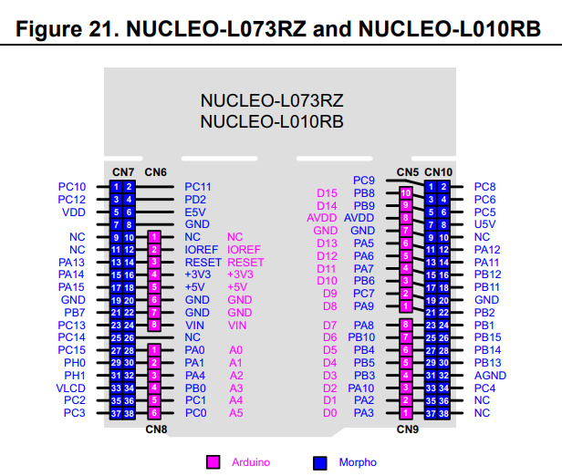
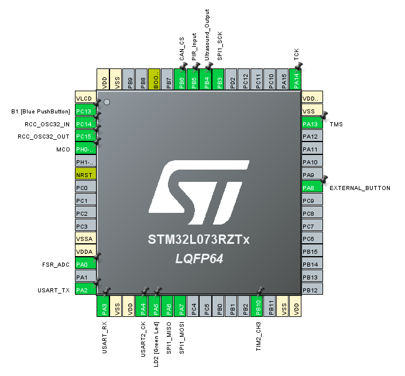
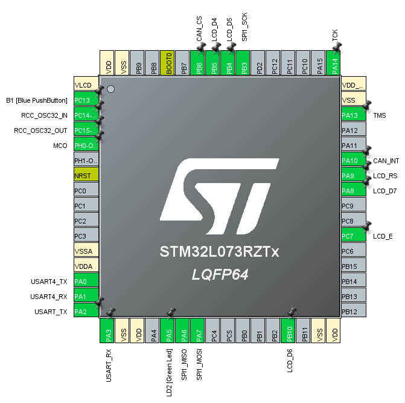
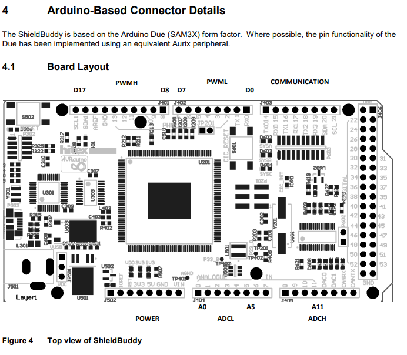
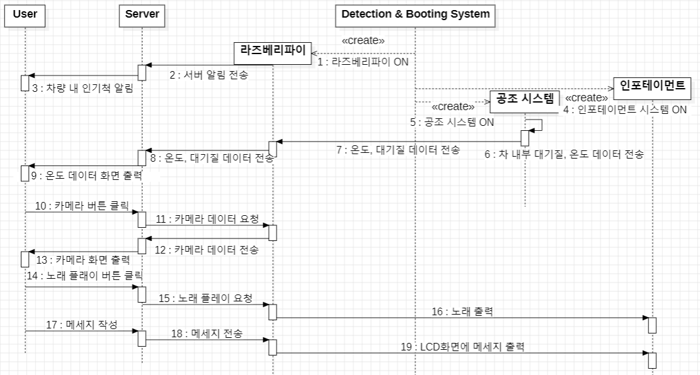
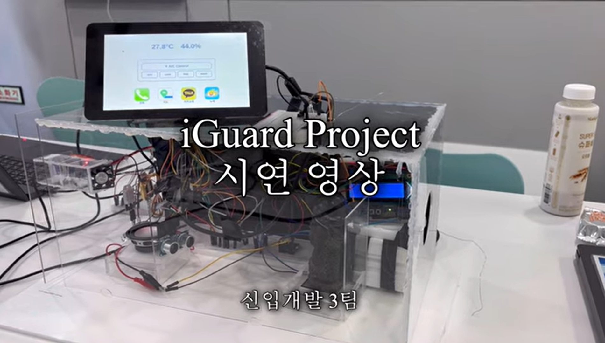
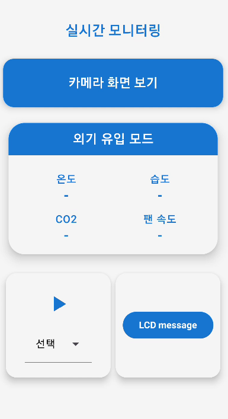

# 🚗 iGuard – 어린이 방치 사고 예방시스템

---

## 👥 팀원 소개

| 배정우 | 조현호 | 박주현 | 김호준 | 김서진 | 박해웅 |
|:------:|:------:|:------:|:------:|:------:|:------:|
| [@jwjungwoo](https://github.com/jwjungwoo) | [@178kg78cm](https://github.com/178kg78cm) | [@ian125](https://github.com/ian125) | [@kimhojun2](https://github.com/kimhojun2) | [@loltochess](https://github.com/loltochess) | [@seabears](https://github.com/seabears) |

---

## 📁 프로젝트 구조

```
iGuard/
├── stm32_boot/
├── stm32_IVI/
├── tc275_hvac/
└── raspberry_pi/
```

---

## 📦 시스템 구성

### 1. 구성 모듈

| 모듈명        | 보드                    | 역할 및 기능                                                                                   | 센서/액추에이터                    |
|---------------|-------------------------|------------------------------------------------------------------------------------------------|-------------------------------------|
| `stm32_boot`  | STM32 Nucleo-L073RZ     | - 센서 수집 (PIR, 초음파, 압력) <br> - Wake-up(`0x1`), Sleep(`0x2`) 메시지 전송                | PIR, 초음파, 압력 센서              |
| `stm32_IVI`   | STM32 Nucleo-L073RZ     | - 음악 재생(`0x5`), 정지(`0x6`), LCD 메시지 출력(`0x10`)                                       | DFPlayer Mini, TextLCD              |
| `tc275_hvac`  | Infineon TC275          | - HVAC 제어 <br> - 상태 응답(`0x20`, `0x21`)                                                 | DC모터, 서보모터                       |
| `RaspberryPi` | Raspberry Pi 4          | - 차량 내부 사진 전송 <br> - CAN ↔ MQTT 브리지 역할                                           | 카메라                              |

---

## 📌 참조 PinMap

### 1. STM32 Nucleo-L073RZ 보드



#### 1-1. 감지 및 부팅 시스템 – `stm32_boot`



| Components          | Pin Name       | Board Pin | Instruction                  |
|---------------------|----------------|-----------|-------------------------------|
| 적외선 센서         | PIR_Input      | PB6       | 적외선 센서 움직임 감지        |
| 초음파 센서 (Trig)  | Ultrasound_Out | PB4       | 초음파 센서 Trig 신호          |
| 초음파 센서 (Echo)  | TIM2_CH3       | PB10      | 초음파 센서 Echo 수신          |
| 압력 센서           | FSR_ADC        | PA0       | 압력 센서 아날로그 입력        |
| 시동 버튼           | EXTERNAL_BTN   | PA8       | 시동 제어 버튼 입력            |
| CAN Module (SS)     | CAN_CS         | PB6       | SPI Slave Select              |
| CAN Module (SCK)    | SPI1_SCK       | PB3       | SPI Clock                     |
| CAN Module (MOSI)   | SPI1_MOSI      | PA7       | SPI Master Out                |
| CAN Module (MISO)   | SPI1_MISO      | PA6       | SPI Master In                 |

#### 1-2. 인포테인먼트 시스템 – `stm32_IVI`



| Components         | Pin Name      | Board Pin | Instruction                       |
|--------------------|---------------|-----------|------------------------------------|
| LCD (D4)           | LCD_D4        | PB5       | 데이터 전송                         |
| LCD (D5)           | LCD_D5        | PB4       | 데이터 전송                         |
| LCD (D6)           | LCD_D6        | PB10      | 데이터 전송                         |
| LCD (D7)           | LCD_D7        | PA8       | 데이터 전송                         |
| LCD (RS)           | LCD_RS        | PA9       | 명령/데이터 모드 전환               |
| LCD (E)            | LCD_E         | PC7       | 데이터 전송 신호                    |
| DFMini Player (TX) | USART4_TX     | PA0       | UART 송신                          |
| DFMini Player (RX) | USART4_RX     | PA1       | UART 수신                          |
| CAN Module (SS)    | CAN_CS        | PB6       | SPI Slave Select                  |
| CAN Module (SCK)   | SPI1_SCK      | PB3       | SPI Clock                         |
| CAN Module (MOSI)  | SPI1_MOSI     | PA7       | SPI Master Out                    |
| CAN Module (MISO)  | SPI1_MISO     | PA6       | SPI Master In                     |
| CAN Module (INT)   | CAN_INT       | PA10      | 인터럽트 감지 핀                   |

---

### 2. Infineon TC275 보드



| 센서/장치                  | 핀 번호                      | 설명                        |
|----------------------------|-------------------------------|-----------------------------|
| MHZ19B (CO₂ 센서)          | D0 (ASC3 RX), D1 (ASC3 TX)    | UART 통신                   |
| DHT (온습도 센서)          | D2                            | 디지털 입력                 |
| 서보 모터 PWM              | D7                            | PWM 제어                    |
| 팬 PWM                    | D3                            | PWM 제어                    |
| 팬 강도 표시용 LED         | D10 (Red), D11 (Yellow), D13 (Green) | 강도 시각화            |
| MQ135 (대기질 측정 센서)   | A2                            | 아날로그 입력               |
| CAN 트랜시버               | A14 (CAN RX), A15 (CAN TX)    | CAN 통신                    |

---

### 2. CAN 통신 프로토콜

| 메시지 | ID | 설명 | 송신자 |
|--------|----|------|--------|
| Wake-up | `0x01` | 차량 기동 시 CAN wake-up 메시지 | `stm32_boot` |
| Sleep   | `0x02` | 차량 정지 시 sleep 메시지       | `stm32_boot` |
| Start Music | `0x05` | 음악 재생 | `RaspberryPi` |
| Stop Music | `0x06` | 음악 정지 | `RaspberryPi` |
| Resume Music | `0x07` | 음악 재개 | `RaspberryPi` |
| Volume Up | `0x08` | 볼륨 증가 | `RaspberryPi` |
| Volume Down | `0x09` | 볼륨 감소 | `RaspberryPi` |
| LCD Message | `0x10` | LCD에 텍스트 표시 | `RaspberryPi` |
| HVAC Control | `0x17` | HVAC 팬 모드 제어 | `RaspberryPi` |
| HVAC Status | `0x20` | HVAC 명령 전송 및 상태 수신, 외부 대기질, co2 전송 | `tc275_hvac` |
| Temp/Humidity | `0x21` | 온습도 전송 | `tc275_hvac` |

---

### 3. MQTT 통신

| Topic           | 설명                                 | Publish        | Subscribe     |
|-----------------|--------------------------------------|----------------|---------------|
| `Car/image`     | 차량 내부 이미지 전송                | `RaspberryPi`  | 앱            |
| `Car/trigger`   | 내부 사진 캡처 요청                  | 앱             | `RaspberryPi` |
| `Car/LCD`       | LCD 표시 문자열                      | `RaspberryPi`  | `RaspberryPi` |
| `Car/music`     | 음악 제어 (재생/정지)                | 앱             | `RaspberryPi` |
| `Car/inside`    | 내부 온도/습도 전송                  | `RaspberryPi`  | 앱            |
| `Car/outside`   | 외부 대기질 전송                     | `RaspberryPi`  | 앱            |
| `Car/detection` | 움직임 감지 알림                     | `RaspberryPi`  | 앱            |

---

### 4. 시스템 흐름도



### 5. 구현 환경 및 시연 영상

[영상 링크](https://www.youtube.com/watch?v=dxATn7LloXw)




## 🔧 기술 스택

- **MCU**: STM32 Nucleo-L073RZ  
- **임베디드 보드**: Infineon TC275  
- **싱글 보드 컴퓨터**: Raspberry Pi 4  
- **통신**: CAN, MQTT  
- **센서**: PIR 모션 센서, 초음파 센서, 압력 센서, 온습도 센서, CO2 센서, 유해가스/공기질 센서
- **액추에이터**: DFPlayer Mini, TextLCD, DC팬, 서보 모터, 카메라

---
